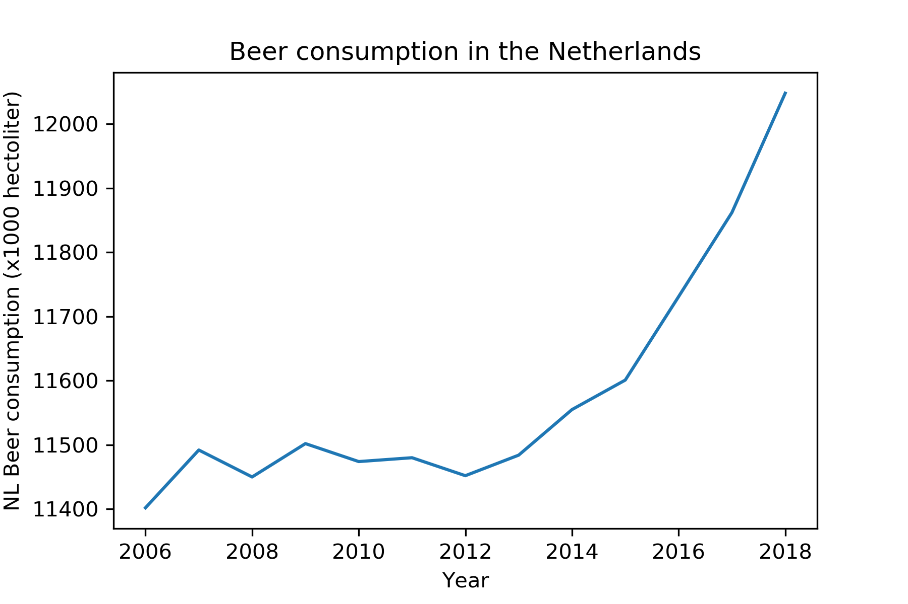

## Seminars Computational Science Assignment 1

Title 1 corrsponding to MCC Van Dyke et al., 2019:  
Fantastic yeasts and where to find them: the hidden diversity of dimorphic fungal pathogens

Title 2 corrsponding to JT Harvey, Applied Ergonomics, 2002:  
An analysis of the forces required to drag sheep over various surfaces

Title 3 corrsponding to DW Ziegler et al., 2005:  
The neurocognitive effects of alcohol on adolescents and college students

Alcohol consumption in the Netherlands seems to have been rising relatively fast the last few years. This is not a good thing. We should be aware!
